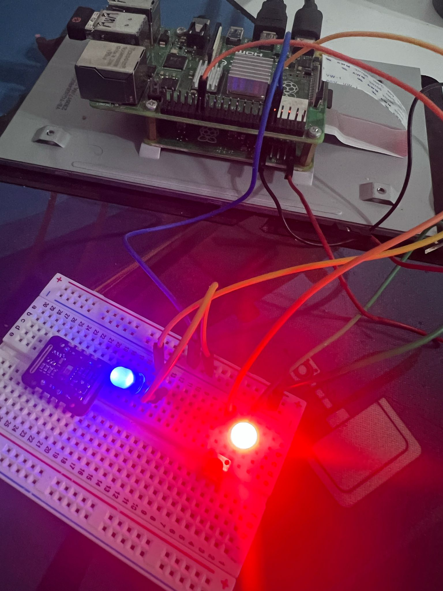
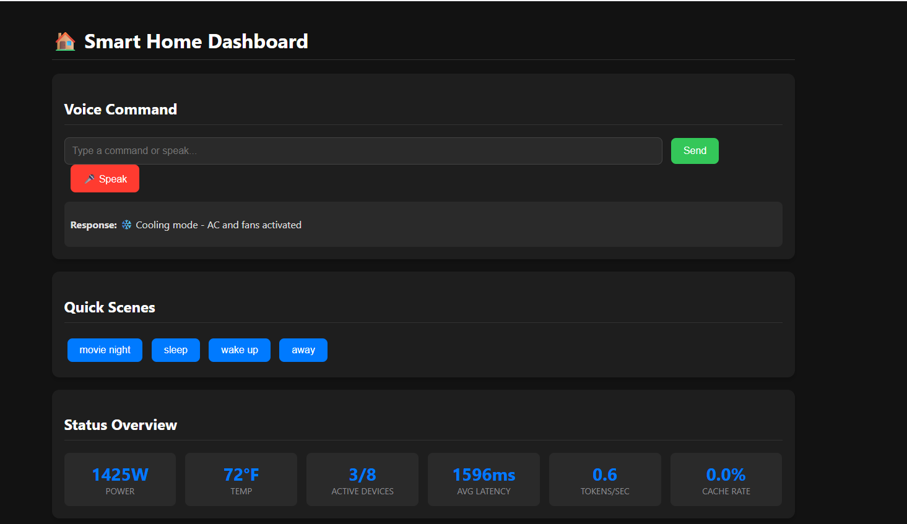
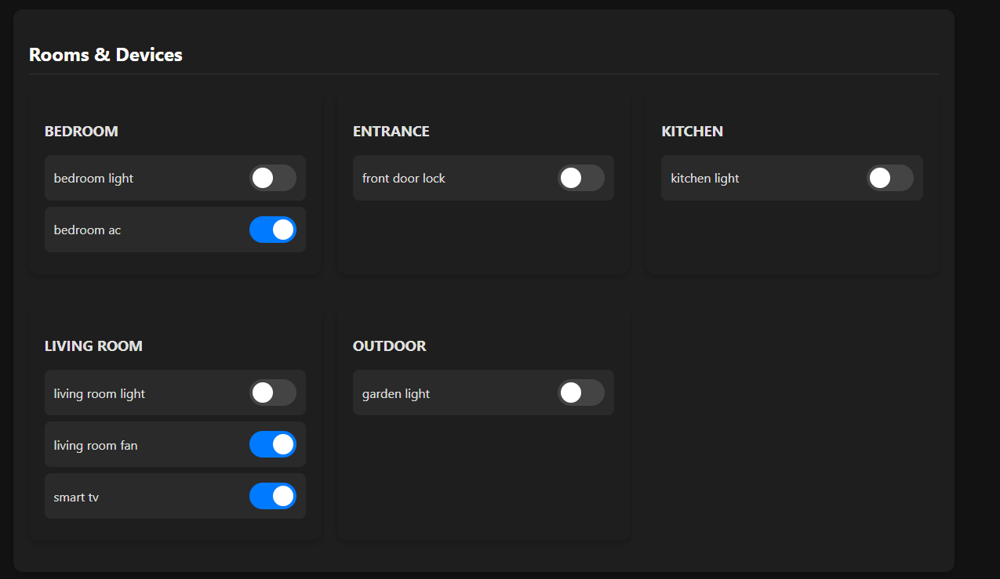
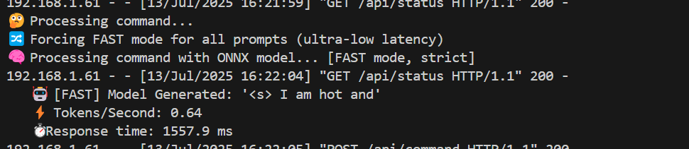
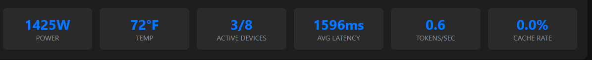

# ONNX Smart Home Assistant for Raspberry Pi 4

A high-performance, AI-powered smart home automation system that runs entirely on Raspberry Pi 4 using ONNX Runtime for ultra-fast inference.

---


_Raspberry Pi 4 with connected smart home devices_

---

## Features

- **Ultra-Fast AI Inference** with ONNX Runtime
- **Natural Language Processing** for device control
- **Web Dashboard** with responsive interface
- **Voice Commands** support
- **Scene Management** for automation
- **Performance Monitoring** in real-time
- **GPIO Control** with simulation mode
- **Power Monitoring** across all devices

---

## Quick Start

### Prerequisites

- Raspberry Pi 4 (4GB+ RAM recommended)
- Python 3.7+
- GPIO access for device control

### Installation

1. **Clone the repository**

   ```bash
   git clone https://github.com/yourusername/fidel-makatia/EdgeAI_Raspi_ONNX.git
   cd onnx-smart-home-assistant
   ```

2. **Install dependencies**

   ```bash
   pip install -r requirements.txt
   ```

3. **Download the ONNX model from Hugging Face**

   ```bash
   # Create model directory
   mkdir -p model

   # Download the model files (you can also clone the repo)
   # Model: https://huggingface.co/Makatia/TinyLlama_TinyLlama-1.1B-Chat-v1.0_onnx
   ```

4. **Run the assistant**

   ```bash
   python smart_home_assistant.py --model_path ./model --port 5000
   ```

5. **Access the web dashboard** at `http://your-pi-ip:5000`

---

## Hardware Setup

### GPIO Pin Configuration

| GPIO Pin | Device            | Room        | Power |
| -------- | ----------------- | ----------- | ----- |
| 17       | Living Room Light | Living Room | 60W   |
| 27       | Living Room Fan   | Living Room | 75W   |
| 22       | Smart TV          | Living Room | 150W  |
| 23       | Bedroom Light     | Bedroom     | 40W   |
| 24       | Bedroom AC        | Bedroom     | 1200W |
| 5        | Kitchen Light     | Kitchen     | 80W   |
| 26       | Front Door Lock   | Entrance    | 5W    |
| 16       | Garden Light      | Outdoor     | 100W  |

---



_Responsive web dashboard for device control and monitoring_

---

## Performance Metrics

The system delivers exceptional performance on Raspberry Pi 4:

- **Average Latency:** 1596ms for complete command processing
- **Tokens/Second:** 0.6 (ONNX optimized)
- **Power Monitoring:** Real-time tracking (1425W total capacity)
- **Active Devices:** 3/8 devices currently active
- **Temperature:** 72°F ambient monitoring



_Live performance metrics from the dashboard_

---

## Voice Commands

### Device Control

- "Turn on the living room lights"
- "Switch off the bedroom AC"
- "Turn off all lights"

### Scene Management

- "Activate movie night"
- "Set sleep mode"
- "Wake up scene"

### Status Commands

- "What's the status?"
- "Show me active devices"
- "Power usage report"

---

## Predefined Scenes

| Scene       | Description                   | Devices Affected               |
| ----------- | ----------------------------- | ------------------------------ |
| Movie Night | Dims lights for entertainment | Living room light (20%), TV on |
| Sleep       | Nighttime automation          | All lights off, bedroom AC on  |
| Wake Up     | Morning routine               | Bedroom and kitchen lights on  |
| Away        | Security mode                 | All lights off, door locked    |

---

## API Endpoints

- `POST /api/command` - Process voice/text commands
- `GET /api/status` - Get system status and device states
- `POST /api/device/toggle` - Toggle individual devices
- `POST /api/scene/activate` - Activate predefined scenes

### Example API Usage

```bash
curl -X POST http://localhost:5000/api/command \
  -H "Content-Type: application/json" \
  -d '{"text": "turn on the lights"}'
```

---

## Configuration

### Adding New Devices

Edit the `_init_devices()` method:

```python
'new_device': Device(
    name='new_device',
    pin=18,
    device_type=DeviceType.LIGHT,
    aliases=['alias1', 'alias2'],
    room='room_name',
    power_consumption=50
)
```

### Adding Custom Scenes

Add to `_init_automation_rules()`:

```python
'custom_scene': {
    'devices': {
        'device_name': {'state': True, 'dim': 50},
    },
    'description': 'Custom scene description'
}
```

---

## Testing

### Simulation Mode

```bash
# GPIO simulation automatically activates if RPi.GPIO is unavailable
python smart_home_assistant.py --model_path ./model
```

---

## Dependencies

Core requirements:

- onnxruntime >= 1.15.0
- transformers >= 4.21.0
- Flask >= 2.3.0
- RPi.GPIO >= 0.7.1
- numpy >= 1.21.0

See `requirements.txt` for complete list.

---

## Architecture

```
Web Dashboard → Flask Server → ONNX Assistant → GPIO Control
                              ↓
                         ONNX Runtime + Rule Engine
```

---

## Contributing

1. Fork the repository
2. Create a feature branch
3. Commit your changes
4. Push to the branch
5. Open a Pull Request

---

## License

MIT License - see LICENSE file for details.

---

## Support

- **Issues:** [GitHub Issues](https://github.com/yourusername/onnx-smart-home-assistant/issues)
- **Model:** [TinyLlama ONNX Model](https://huggingface.co/Makatia/TinyLlama_TinyLlama-1.1B-Chat-v1.0_onnx)
- **Documentation:** See project wiki

---

Made with ❤️ for the Smart Home Community
